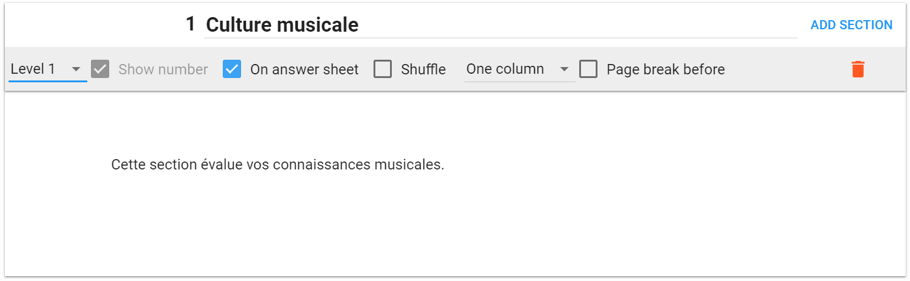
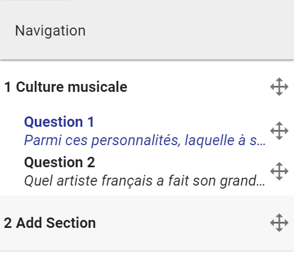
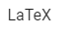
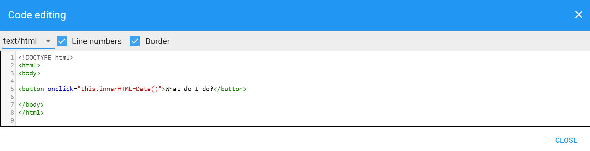
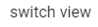
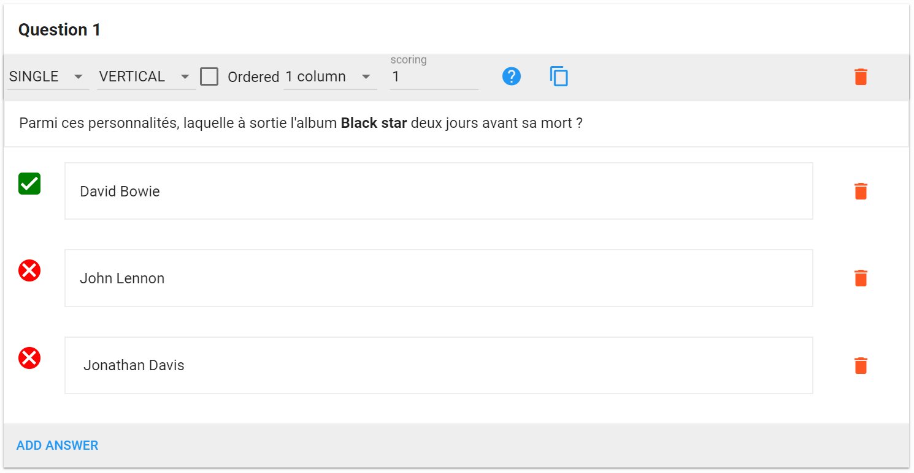
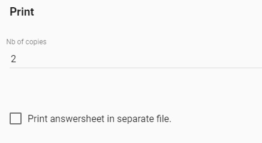
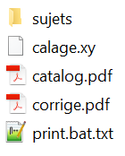

# Edit : de la création à l&#39;impression

Maintenant que nous savons comment créer un projet et gérer les informations du compte, nous pouvons nous atteler à la création d&#39;examens

## Chargement du Template et ajout d&#39;informations administratives

Lorsque vous venez de créer un projet, il n&#39;y a pas encore de Template chargé. Choisissez dans le menu déroulant le type de Template que vous souhaitez utiliser dans votre projet.

 

 

Figure 10 Édition - Chargement d&#39;un Template

À l&#39;heure actuelle, il y a trois Templates avec chacun ses spécificités. Les deux premiers possèdent la mise en page avec la disposition pour les informations administratives propre à la HEG-Arc qu&#39;il ne vous restera plus qu&#39;à compléter. Le Template HEC possède quant à lui la mise en page nécessaire pour les examens de l&#39;université de Lausanne. Dans le cadre de ce tutoriel, nous allons choisir le Template HEG-QCM (prends en charge une feuille de réponse). Si vous souhaitez scanner un examen complet avec beaucoup de questions ouvertes, préférez alors le Template HEG-Open (pas de feuille de réponse).

Une fois le Template choisi, cliquer sur **Load** pour charger le Template dans votre projet. Vous pouvez maintenant créer et élaborer l&#39;examen ! Patientez jusqu&#39;à ce que le bouton **Compiling** devienne **Preview** avant d&#39;attaquer la suite. _ _

 

Figure 11 Édition - Barre de menu

 

La Figure 11 présente la barre de menu disponible dans l&#39;onglet **Edit.** Le premier bouton **Document properties** vous permet de mettre en place les informations administratives, comme présenté à la Figure 12.

Les propriétés du Template de cette année vous permettent d&#39;ajouter le titre du cours, le nombre de points totaux de l&#39;examen ainsi que la session durant laquelle l&#39;examen sera passé.

Ces paramètres peuvent changer d&#39;année en année.

Ceux-ci seront alors visibles lorsque vous cliquez sur le bouton **Preview** (Figure 11). Ce bouton permet d&#39;ouvrir une boîte modale (une fenêtre à l&#39;intérieur de l&#39;application) vous permettant alors de visualiser l&#39;examen. Très utile avant de l&#39;imprimer ! Faites bien attention à toujours attendre que le bouton _Preview_ soit disponible.

Ne cliquez pas dessus s&#39;il est encore en compilation, cela risque d&#39;entraîner quelques bugs. La boîte modale (Figure 13) montre un exemple de visualisation pour le Template HEG-QCM que nous venons de charger.

Nous voyons bien que les informations insérées dans les documents properties sont bien présentes dans l&#39;examen lorsque l&#39;on visualise ce dernier.

 

Figure 13 - Boîte modale de prévisualisation

Les boutons _LaTeX options_ permet d&#39;accéder directement au code LaTeX. Il est possible d&#39;effectuer des modifications directement dans les fichiers sources, mais cela nécessite une compréhension du langage LaTeX. Pour faire simple, chaque action effectuée dans l&#39;onglet d&#39;édition, comme ajouter une nouvelle question par exemple, va dynamiquement changer le code LaTeX. C&#39;est lui qui va mettre à jour l&#39;examen final que vous allez visualiser puis imprimer.

Ce document n&#39;étant pas destiné à expliquer et documenter les possibilités qu&#39;offre le code LaTeX, nous n&#39;irons pas plus loin.

Le bouton _Print_ génère les différents fichiers et condense le tout dans un fichier .zip que vous pouvez télécharger, des options d&#39;impression sont disponible dans l&#39;onglet **option** que nous parcourrons plus tard dans ce document.

## Élaboration de l&#39;examen

Chapitre dédié à l&#39;élaboration de l&#39;examen jusqu&#39;à son impression en passant par les éventuelles options disponibles dans AMCUI. Cette étape ne peut se faire que si vous avez un Template chargé dans l&#39;application (Chapitre 3.1).

### Ajout d&#39;une section

Pour bien gérer vos sections, il vous faut d&#39;abord comprendre comment fonctionne la barre de menu lié à une section (Figure 14). Une section correspond en général à un chapitre du cours, mais vous pouvez les utiliser comme vous le désirez. Nous allons remplacer le texte **« Add Section »** par le nom du chapitre sur lequel nous allons tester les étudiants, dans le cadre de ce tutoriel nous allons nommer la section « Culture musicale ». Juste en dessous de la barre de menu de la section, vous pouvez entrer un texte explicatif concernant la section (facultatif).

 

Figure 14 Boîte de section

Nous allons maintenant passer en revue chaque fonctionnalité de la barre de menu (Figure 14) de gauche à droite.

Le premier élément à gauche est une liste déroulante vous permettant de choisir le niveau de la section. Elles sont similaires à la numération des chapitres dans Word.

Ainsi le niveau 1 aura un simple numéro, généralement dédié à un chapitre comme dans l&#39;exemple montré à la Figure 14 (1). Le niveau 2 correspond généralement à un sous-chapitre et aura deux numéros (par exemple 1.1). Le niveau 3 suit la même logique et sa numération est constituée de trois numéros (par exemple 1.1.1).

Le deuxième élément **« Show number »** permet d&#39;afficher/cacher le numéro de la section dans l&#39;examen.

Le troisième élément **« On answer sheet »** permet d&#39;afficher le nom de la section dans la feuille de réponse si la case est cochée. La feuille de réponse est l&#39;avant-dernière feuille lorsque vous visualisez l&#39;examen. C&#39;est sur celle-ci que l&#39;étudiant notera ses réponses.

Le quatrième bouton **« shuffle »** permet de mettre les questions dans le désordre au sein d&#39;une section. Très pratique pour imprimer une deuxième série.

Le cinquième élément représente le **nombre de colonnes** sur lequel vous désirez afficher vos questions. Pour l&#39;instant soit vous pouvez utiliser une colonne et ainsi avoir toutes les questions les unes après les autres ou avoir deux colonnes pour avoir une question à droite et une question à gauche à la même hauteur dans l&#39;examen (exemple aux Figure 16 et Figure 17).

Le sixième bouton **« page break »** vous permet de faire un saut de page pour être sûr de commencer la section sur une nouvelle page.

La corbeille en rouge vous permet de supprimer la section (attention, il n&#39;y a pas encore de message d&#39;alerte, l&#39;effacer est donc permanent ! Mais vous pouvez toujours utiliser une fonction restore depuis l&#39;onglet **« history »** )

 

Finalement le bouton **« add section »** vous permet d&#39;ajouter une nouvelle section.

Vous avez la possibilité de naviguer entre vos différentes sections en utilisant le menu disponible à gauche de l&#39;écran (Figure 15).

Vous pouvez également depuis ce menu de navigation utiliser les flèches directionnelles afin de changer la position d&#39;une section ou même déplacer une question dans une autre section.

 

 

Figure 17 Exemple d&#39;affichage sur deux colonnes

### Barre d&#39;édition (questions)

AMCUI vous propose d&#39;éditer et gérer le style de vos réponses avec la barre de menu qui apparaît lorsque vous souhaitez écrire la question (Figure 18 Barre d&#39;édition de question). De gauche à droite nous avons :

 

Figure 18 Barre d&#39;édition de question

 

 

 

 
 pour mettre un élément sous format LaTeX

 
 pour mettre un élément dans un format de type :

**p** – paragraphe

**h1** – header 1 (grand titre)

**h2** – header 2 (titre moyen)

**h3** – header 3 (petit titre)

 
 Liste à puce

 
 Liste numérotée

 
 placer la sélection au centre

 
ajouter une image (préférez une image au format PNG)

 
 ajouter un bloc de code

Le bloc de code s&#39;ajoute sous la forme d&#39;une boîte, cliquer dessus pour ajouter votre code et choisir le type de langage (pour les couleurs).

 

Figure 19 Bloc de code dans l&#39;éditeur

En cliquant sur le bloc de code dans l&#39;éditeur (Figure 19), une nouvelle fenêtre modale apparaît comme montrée dans la Figure 20. Le premier élément de cette boîte modale est une liste déroulante vous permettant de choisir le langage utilisé. Dans l&#39;exemple ci-dessous nous avons mis un petit bout de code HTML. Une fois l&#39;élément de liste choisi en HTML le code se met en couleur, pratique pour la lisibilité du code.

 

Figure 20 Bloc de code - Modale

 
 permets de mettre un contour à la question (peut-être utile si la question se trouve sur deux pages ou tout simplement si vous aimez mettre des bordures partout !)

Si vous vous êtes trompé et désirez supprimer le contour, passez en mode HTML avec le bouton **Switch View** et supprimer les balises &lt; **box** &gt; et &lt;/ **box** &gt;.

 
 permet de changer la vue en passant du texte plein à du code HTML

### Ajout d&#39;une question (généralités)

Maintenant que vous savez comment gérer une question, il est temps d&#39;aller droit au but: la mise en place des questions. Comme dans le chapitre précédent, nous allons d&#39;abord comprendre comment la barre de menu des questions est utilisée et à quoi sert chaque bouton. Tout d&#39;abord cliquer sur le bouton **« Add question »** qui se situe juste en dessous du bloc de section. Une nouvelle boîte apparaît alors. Nous allons maintenant détailler les fonctionnalités mises à dispositions par cette boîte, comme pour la barre de menu de la section, nous allons balayer les fonctionnalités de gauche à droite (Figure 21).

 

Figure 21 Barre de menu de la boîte de question

Le premier élément est une liste déroulante vous permettant de choisir **le type de question** que vous voulez insérer. À l&#39;heure actuelle, il existe trois types de questions

- -- **Single** Question à choix unique (une seule bonne réponse possible)
- -- **Multiple** Question à choix multiple (une à plusieurs bonnes réponses possibles)
- -- **Open** Question ouverte (avec bloc de réponse)

Nous verrons comment mettre en place chacune des questions un peu plus loin dans ce guide.

Le deuxième élément représente la manière dont vous voulez afficher vos réponses (dans le cas d&#39;une question de type single ou multiple). Vous pouvez les afficher de manière verticale (option par défaut) comme montrée dans les Figure 16 et Figure 17 ou de manière horizontale, faites votre choix !

Le troisième élément **« Ordered »** est une case à cocher permettant de définir si les réponses doivent toujours s&#39;afficher dans l&#39;ordre dans lequel vous avez créé les réponses. En décochant cette case, les réponses ne seront pas dans le même ordre d&#39;une copie à l&#39;autre.

Le quatrième élément est une nouvelle liste déroulante, vous permettant ainsi de choisir si vous voulez afficher vos réponses sur une, deux ou trois colonnes. C&#39;est un peu le même principe que pour l&#39;affichage des questions sur une ou deux colonnes, mais cette fois pour les réponses !

Le cinquième élément, et pas des moindres est l&#39;élément contenant le mot clef **scoring**. Il vous permet de paramétrer des attributs de la question. La liste des attributs est disponible dans le sous-chapitre 3.2.7 qui est dédié à la mise en place du barème et des propriétés LaTeX des questions.

## Types de questions

### Question à choix simple

Une question à choix simple ne possède qu&#39;une seule bonne réponse.

Cliquer sur **« Add question »** dans la boîte qui se trouve en dessous de la section. Puis sélectionner dans le premier élément (liste déroulante) le mot clef **single**. Nous allons créer une question qui vaut 1 point. Par défaut, une question vaut 1 point, nous pouvons donc laisser l&#39;élément **scoring** vide. Puisque nous sommes toujours dans la section **Culture musicale** que nous avons créée précédemment nous allons donc ajouter une question d&#39;ordre musical.

En dessous de la barre de menu de question existe un espace libre pour écrire votre question. La question est la suivante :

_« Parmi ces personnalités, laquelle a sorti l&#39;album Black star deux jours avant sa mort ? »_

En dessous de la question se trouvent les blocs de réponses QCM. Nous allons donc écrire la bonne réponse qui est bien sûr **David Bowie**. Puisque c&#39;est la bonne réponse, cliquez tout simplement sur la petite croix blanche et rouge à gauche du bloc de réponse pour que le projet détecte la réponse comme étant correct.

Afin de rendre la question un peu plus difficile, nous allons ajouter deux autres réponses avec à peu près le même prénom, John Lennon et Jonathan Davis. Pour ce faire cliquer sur le bouton **Add Answer** et ajouter les nouvelles réponses.

 

Figure 22 Question à choix simple

### Question à choix multiple

Une question à choix multiple possède une ou plusieurs bonnes réponses et possède toujours le symbole du trèfle ( 
 ) à côté du numéro de la question. Cliquer sur **Add question** en bas de la page pour ajouter une nouvelle question et choisissez dans la liste déroulante le mot clef **multiple**.

Dans une question multiple, il y a toujours la réponse «  **None of the above »** qui apparaît dans le cas où aucune réponse n&#39;est correcte. Dans ce tutoriel nous voulons une logique assez simple pour compter le nombre de points par question.

Nous voulons définir qu&#39;une réponse correcte vaut 2 points et qu&#39;une mauvaise réponse vaut -1 point.Nous allons nous référer au sous-chapitre 3.2.7 qui explique les différents attributs possibles.

La question est la suivante _« Lequel de ces titres n&#39;est pas une chanson ? »_ Voici un exemple de ce que nous venons de créer à la Figure 23.

 

Figure 23 Question à choix multiple

Ne vous inquiétez pas, la dernière réponse disponible **None of the above** est automatiquement traduite en français dans l&#39;examen final.

Utilisez maintenant le bouton de prévisualisation ( **Preview** ) pour admirer le résultat !

La définition des points s&#39;effectuera au sous-chapitre 3.2.7, par défaut la question vaut 1 point et toutes les bonnes réponses doivent être cochées ( **mz=1** par défaut).

### Question ouverte

Une question ouverte ne peut pas être corrigée automatiquement, cependant vous pourrez directement attribuer le nombre de points lors de la phase de correction pour faciliter le calcul de la note finale. Une question ouverte comporte toujours un bloc de réponse que vous pouvez manipuler. La barre de menu de question change un peu pour les questions ouvertes, nous allons visiter les fonctionnalités offertes par cette nouvelle barre de menu(Figure 24).

 

Figure 24 Barre de menu - question ouverte

Le premier élément est le même que pour les questions à choix, il s&#39;agit de la liste déroulante permettant de choisir le type de question.

Le deuxième élément est une case à cocher nommée **Dots** ou points en français permettant de cacher ou d&#39;afficher une ligne de points par ligne dans le bloc de réponse.

Le troisième élément **« lineup »** permet de placer le bloc de réponse dans l&#39;examen s&#39;il est coché. S&#39;il n&#39;est pas coché, le bloc de réponse apparaît alors dans la feuille de réponse (l&#39;avant-dernière page de l&#39;examen). Utiliser le bouton de prévisualisation pour choisir la manière dont vous voulez le mettre en place.

Le quatrième élément **« lines »** vous permet de choisir le nombre de lignes que le bloc de réponse doit avoir.

Le cinquième élément **scoring** dans le cadre des questions ouvertes n&#39;est pas similaire aux autres éléments **scoring** des questions à choix simple et multiple. Ici vous n&#39;avez qu&#39;à indiquer le nombre de points que vous désirez attribuer à la question. Nous définissons une question à 6 points.

 

Notre question ouverte sera _« Qui est Serge Tankian ? Veuillez développer et préciser comment il a réalisé ses plus grandes œuvres._ »

Nous allons ajouter une image en utilisant la barre d&#39;édition de texte pour donner un peu plus de détail aux étudiants. Après tout il est plus facile de retenir un visage qu&#39;un nom. L&#39;exemple de la Figure 25 montre le résultat obtenu. Enfin nous plaçons 6 points à la question et mettons à dispositions 6 lignes de réponses. Nous n&#39;allons pas activer les **Dots** afin que l&#39;étudiant puisse gérer le bloc de réponse comme il le souhaite.

Vous pouvez constater le nombre de points qui apparaît au-dessus du bloc de réponse.

Une fois les trois questions créées nous allons faire en sorte que le tout tienne sur une page. La première question aura les réponses affichées horizontalement. La deuxième question aura les réponses affichées verticalement sur deux colonnes et finalement nous rapetissons l&#39;image de la question ouverte et la centrons. La prévisualisation des trois questions se trouve à la Figure 26.

 

Figure 26 Prévisualisation de l&#39;examen avec une question de chaque type

## Copier des questions et sections

Vous pouvez copier des questions, des sections ou le projet entier vers un nouveau projet. Très utile dans le cas ou votre examen ne change pas vraiment et que vous ne souhaitez apporter que quelques modifications ou tout simplement pour récupérer un Template sur lequel vous avez travaillé.

Pour ce faire, rendez-vous dans le menu de navigation à gauche dans l&#39;onglet d&#39;édition. À la fin de la dernière section et de la dernière question se trouve un bouton **« Activate copy »**.

Cliquez dessus et sélectionnez les éléments que vous désirez importer puis choisissez le projet de destination. Le projet source étant le projet sur lequel vous êtes actuellement.

Dans ce cas nous voulons copier la question 3 de la section vers le projet « test\_2 ».

 

Figure 34 Copier un élément vers un autre projet

 

Une fois le projet sélectionné une nouvelle ligne s&#39;affiche comportant le bouton copy. Appuyez dessus pour lancer la copie.

Cela va automatiquement vous changer de projet et vous pourrez constater que la copie s&#39;est bien effectuée vers le nouveau projet.

 

Vous pouvez tout à fait copier une section ou une question vers le même projet, utile lorsque vous avez travaillé sur le format qu&#39;une question de manière à éviter de refaire le même travail.

## Impression des séries

Pour l&#39;étape d&#39;impressions, il y a quelques petits paramétrages disponibles dans l&#39;onglet options.

- --Le nombre de copies que vous désirez imprimer
- --Si la feuille de réponse est générée dans un fichier séparé ou non

(Pratique pour ne scanner que la feuille de réponse)

Dans ce petit tutoriel, nous allons imprimer 2 copies d&#39;examens afin d&#39;avoir 2 séries que nous photocopierons pour les étudiants (par exemple 10 copies de la série A et 10 copies de la série B). Vous pouvez également si vous le souhaitez avoir une fiche par étudiant (si vous avez une classe de 30 étudiants, vous pouvez demander la génération de 30 copies). Pour faciliter un peu la logistique, nous n&#39;allons pas séparer la feuille de réponse dans un autre fichier PDF. Nous ne cochons donc pas la case **« Print answersheet in separate file. »**.

 

Figure 37 Options d&#39;impression

Appuyez sur le bouton **« save options »** et retournez dans l&#39;onglet d&#39;édition. Vérifiez bien que votre examen correspond à vos attentes via le bouton de prévisualisation, si vous n&#39;êtes pas satisfait faites les dernières modifications avant de lancer l&#39;impression.

Dans notre cas nous allons changer le nombre de points dans les documents properties afin de matcher le nombre de points dans l&#39;examen. La première question vaut 1 point, la deuxième vaut 6 points et la dernière aussi 6 points, nous écrivons donc 10 dans la case correspondante des **documents properties** pour avoir un total de 13 points affiché sur la page de garde. Vérifiez que vous avez tout paramétré correctement (au niveau de l&#39;affichage des questions ou au niveau des points) afin de ne pas avoir à réimprimer le sujet.

Une fois que vous êtes prêt, appuyez alors sur le bouton **« print »** qui se situe en haut à droite dans la barre de menu de l&#39;onglet édition. Une barre de progression s&#39;affiche, l&#39;application génère alors vos précieux fichiers PDF dans un dossier ZIP.

 

Voici ce qui se trouve à l&#39;intérieur du fichier zip.

Les sujets sont vos différentes séries (dans notre cas nous avons deux séries grâce au paramétrage du nombre de copies). Et à la racine vous avez le catalogue qui est concrètement la version de base l&#39;examen ainsi que le corrigé.

Nous allons imprimer une version de chaque série (dossier sujets). Lors du passage de l&#39;examen, n&#39;hésitez pas à rappeler à vos étudiants de bien colorier les cases à cocher.

TODO: bat files
