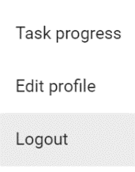
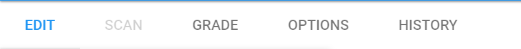

# Commencer avec AMCUI

## Création de compte

Lorsque vous arrivez sur [https://amcui.ig.he-arc.ch/](https://amcui.ig.he-arc.ch/), vous avez la possibilité de vous loguer ou de créer un nouvel utilisateur en saisissant votre nom d'utilisateur et un mot de passe.

::: danger ATTENTION
Il n'y a pas de double vérification de mot de passe! En cas de problème, de il faut contacter l'administrateur.
:::

Une fois connecté vous avez la possibilité de créer votre premier projet AMCUI !

## Création de projet

 L'application fonctionne par projet. Un projet signifie un examen et tout ce qui va avec (copies des étudiants, correction, solutions, annotations, etc.).

*Figure 2 - Création d'un projet*

::: warning
Vous ne pouvez utiliser que des caractères de 0 à 9, les lettres en minuscules ainsi que le trait d'union ( - ) et l'underscore ( \_ ).
:::

::: tip
TODO grouping
:::

## Chargement d'un projet

Si vous avez déjà un projet dans l'application, utiliser alors la boîte de la Figure 3 il suffit de cliquer sur le projet pour le charger dans l'application.

 
*Figure 3 Liste des projets de l'utilisateur*

Pour revenir à cette page et changer de projet il suffit de cliquer sur le logo d'AMCUI en haut à gauche.

Votre nom d'utilisateur apparaît en haut à droite et en cliquant dessus et cela vous donne accès à la barre de progression, une page de gestion de votre compte ainsi que la possibilité de vous déconnecter.

 
 
*Figure 4 - Menu global*

::: warning
Notez que si vous êtes absent et que votre session est toujours enclenchée, l'application ne vous reconnaîtra plus après environ 6h d'absences. Pour éviter les problèmes rechargez la page après une absence prolongée.
:::

## Navigation dans un projet

Dans AMCUI, se repérer est très simple. Chaque onglet est utilisé pour une étape spécifique du processus.

 
*Figure 9 - Barre de menu*

- [**EDIT**](/edit.html)  : création, prévisualisation et impression de l'examen.
- [**SCAN**](/scan.html) : c'est là que les copies scannées des étudiants seront uploadées vers le projet avec la possibilité de visualiser les copies
- [**GRADE**](/grade.html) : annotations des copies, gestion des étudiants/examens, du barème et de la note.
- **OPTIONS** : permets de régler certains paramètres comme le nombre de copies ou le seuil de détection de noir dans une case à cacher.
- **HISTORY** : un récapitulatif des actions que vous avez effectuées. Offre la possibilité de remettre le projet dans un état antérieur avec la fonction **restore**.

L'ordre des onglets suit la logique du processus (créé, scanné, corrigé) de gestion d'examens écrits.

## Changer de mot de passe

Le bouton  **Edit profile,** accessible depuis le menu déroulant en cliquant sur le nom d'utilisateur, vous permet de changer votre mot de passe.

 
*Figure 5 Fenêtre d'édition du mot de passe*

Il est également possible d'activer [l'authentification à deux facteurs](advanced.html#authentification-a-deux-facteurs).