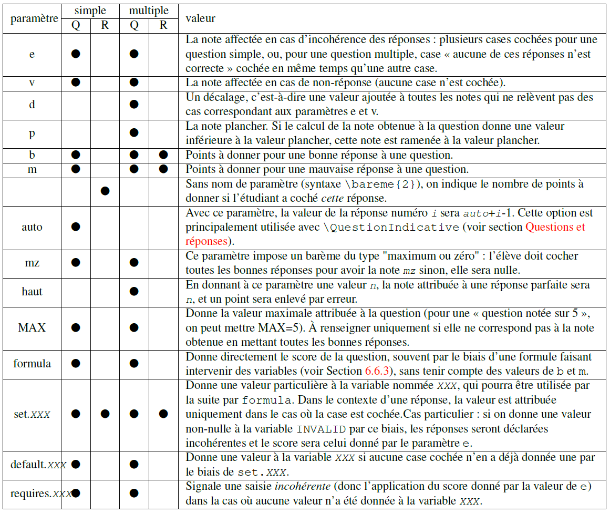
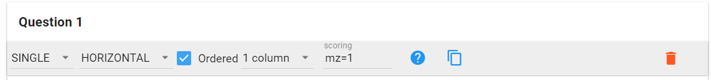
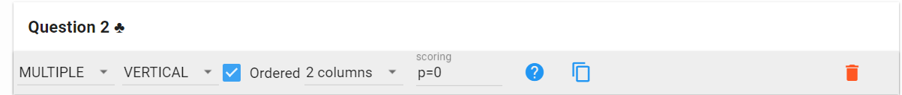
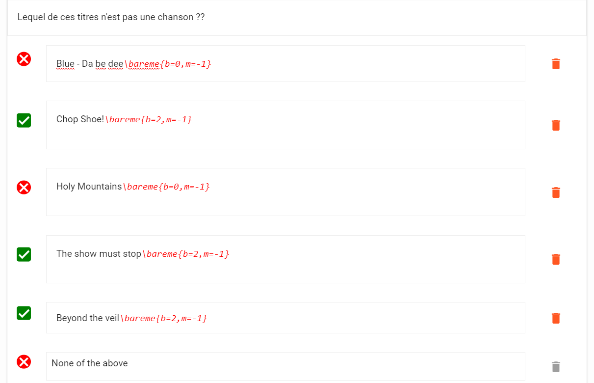
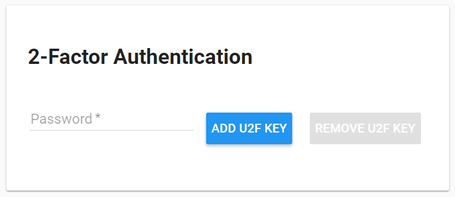
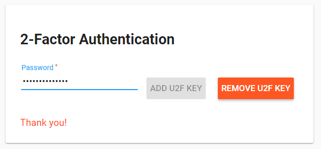

# Options avancées

## Partager un projet

Dans l'onglet **option,** le premier élément configurable est la section **Collaborators** et elle permet le partage du projet. Il suffit d'entréer le nom d'utilisateur à ajouter et d'appuyer sur `ENTER`.

## Paramétrage du barème pour une question

Il vous est possible de définir le nombre de points attribuable à chaque réponse (ou tout simplement laisser les options par défaut permettant d'avoir 1 point par question) soit dans l'élément **scoring** des QCM soit directement dans la réponse.

Pour ce faire, basez-vous sur le tableau suivant :

 
 [https://www.auto-multiple-choice.net/auto-multiple-choice.fr/interface-graphique.shtml#bareme](https://www.auto-multiple-choice.net/auto-multiple-choice.fr/interface-graphique.shtml#bareme)
*Figure 27 Tableau des paramètres*

Il vous est possible de mettre en place ces paramètres dans les éléments **scoring** des questions à choix simple et multiple.

Par exemple pour la première question que nous avons créée dans la section [(question-a-choix-simple)](edit.html#question-a-choix-simple) le paramètre par défaut est **mz=1** ce qui signifie que l'élève doit faire une réponse parfaite pour obtenir le nombre de point égal à la valeur de **mz**. Si la valeur par défaut **mz** n'était pas gérée par l'application, vous auriez alors dû écrire vous-même le paramètre dans la section **scoring** comme présentée à la Figure 28 Paramétrage d'un attribut (scoring). S'il y a plusieurs attributs, séparez-les par une virgule.

 
*Figure 28 Paramétrage d'un attribut (scoring)*

Dans le cadre de la deuxième question (choix multiple) crée dans la section [(edit.html#question-a-choix-multiple)](edit.html#question-a-choix-multiple) nous désirons affecter 2 points par réponse correcte et -1 point par mauvaise réponse. Nous voulons aussi mettre en place le fait qu'une réponse correcte qui n'a pas été cochée enlève 1 point.

Placer la commande **\bareme** après une réponse permet d'indiquer le nombre de points que nous souhaitons lui attribuer. Lorsque vous éditez le contenu de la réponse, placer votre curseur à la fin de la réponse et cliquer sur le bouton LaTeX. Le code doit alors s'afficher en rouge et ne sera bien évidemment pas visible dans la version imprimée. Juste après la commande, ouvrez des accolades et insérez vos attributs comme montrés dans la Figure 30.

 
*Figure 29 Barre d'édition de contenu (focalisé sur LaTeX)*

Par exemple, une bonne réponse doit donner 2 points si elle est cochée et -1 point si elle est oubliée. Nous utilisons donc les attributs **b** et **m**. 
*Figure 30 - Code LaTeX - barème bonne réponse*

En nous basant sur le tableau de la Figure 27, nous utilisons la propriété **b** qui définit le nombre de points d'une bonne réponse, et **m** qui définit le nombre de points à donner pour une mauvaise réponse. Pour les mauvaises réponses, elles donnent naturellement 0 point, mais si elles sont cochées alors nous allons donner -1 point à l'étudiant.

 
*Figure 31 Code LaTeX - barème mauvaise réponse*

Nous allons répliquer ces commandes sur toutes nos réponses. Grâce à cette méthode, vous avez la possibilité d'accorder plus ou moins de points à une certaine réponse que vous trouvez par exemple très importante ou inversement enlever plus de points sur une réponse spécifique.

Nous allons également fixer la note plancher à 0. C'est un attribut général qui s'applique à la question, nous pouvons donc écrire **p=0** dans l'élément **scoring**. Toute la liste des attributs et leurs explications sont disponibles à la Figure 27.

 
*Figure 32 Code LaTeX - note plancher à 0*

Il ne s'agit que d'un exemple et rien ne vous oblige à appliquer un barème de ce type-là. Il est tout à fait possible de garder le système qui par défaut offre un point par question. Vous pouvez également ne pas mettre de note plancher, à ce moment-là un étudiant peut avoir un nombre de points négatif à une question.

 
*Figure 33 Application de la commande \bareme sur les réponses*

Nous avons donc paramétré avec précision le nombre de points de chaque réponse pour la question 2. Pour synthétiser :

- La commande barème permet de définir le nombre de points d'une question
- L'attribut **p** (=0) signifie que nous avons fixé la note plancher à 0 (l'étudiant ne pourra pas avoir de point négatif)
- Bonne réponse (case verte à gauche de la réponse):
  - L'attribut **b** (=2) signifie que si la case est cochée cela fournira 2 points à l'étudiant
  - L'attribut **m** (=-1) signifie que si la case a été oubliée, alors l'étudiant aura un malus de 1 point
- Mauvaise réponse (case rouge à gauche de la réponse) :
  - L'attribut **b** (=0 )signifie que cette réponse ne donne pas de point si on l'oublie
  - L'attribut **m** (=-1) signifie que si cette réponse est cochée, alors elle fournira -1 point.

Le but de cette documentation utilisateur est de vous aider à mettre en place un projet AMCUI et non de vous offrir une liste exhaustive de toutes les possibilités offertes par le code LaTeX.

## Authentification à deux facteurs

Il est possible d'activer une authentification à deux facteurs avec une clef U2F.

 

Branchez votre clef U2F et écrivez votre mot de passe puis cliquez sur le bouton **ADD U2F KEY**. L'application va vous demander de brancher/activer votre clef U2F. Vous obtiendrez le résultat de la Figure 8.

 
*Figure 8 Authentification à deux facteurs en place*

Maintenant lorsque vous vous connectez à l'application, vous devrez activer votre clef U2F après avoir inséré vos informations de connexion (login + mot de passe). Pour enlever la double authentification, insérez votre mot de passe et cliquez sur **REMOVE U2F KEY**.
