# Edit : de la création à l'impression

Le processus de création comporte le choix du modèle, l'ajout des sections, questions et réponses et finalement l'impression des épreuves.

## Chargement du modèle (template)

Lorsque vous venez de créer un projet, il n'y a pas encore de modèle chargé. Choisissez dans le menu déroulant le type de Template que vous souhaitez utiliser dans votre projet.

 
*Figure 10 Édition - Chargement d'un Template*

À l'heure actuelle, il y a trois Templates avec chacun ses spécificités. Les deux premiers possèdent la mise en page avec la disposition pour les informations administratives propre à la HEG-Arc qu'il ne vous restera plus qu'à compléter.  Dans le cadre de ce tutoriel, nous allons choisir le Template HEG-QCM (prends en charge une feuille de réponse).

- **HEG-QCM** est configuré pour une page de réponse à la fin de l'examen.
- **HEG-OPEN** est configuré pour scanner toutes les pages de l'examen.

Une fois le Template choisi, cliquer sur **Load** pour charger le Template dans votre projet. Vous pouvez maintenant créer et élaborer l'examen ! Patientez jusqu'à ce que le bouton **Compiling** devienne **Preview** avant d' le consulter.

Les boutons _LaTeX options_ permet d'accéder directement au code LaTeX. Il est possible d'effectuer des modifications directement dans les fichiers sources, mais cela nécessite une compréhension du langage LaTeX. Pour faire simple, chaque action effectuée dans l'onglet d'édition, comme ajouter une nouvelle question par exemple, va dynamiquement changer le code LaTeX. C'est lui qui va mettre à jour l'examen final que vous allez visualiser puis imprimer.

## Ajout d'informations administratives

 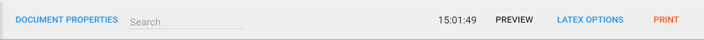
*Figure 11 Édition - Barre de menu*

La Figure 11 présente la barre de menu disponible dans l'onglet **Edit.** Le premier bouton **Document properties** vous permet de mettre en place les informations administratives, comme présenté à la Figure 12.

 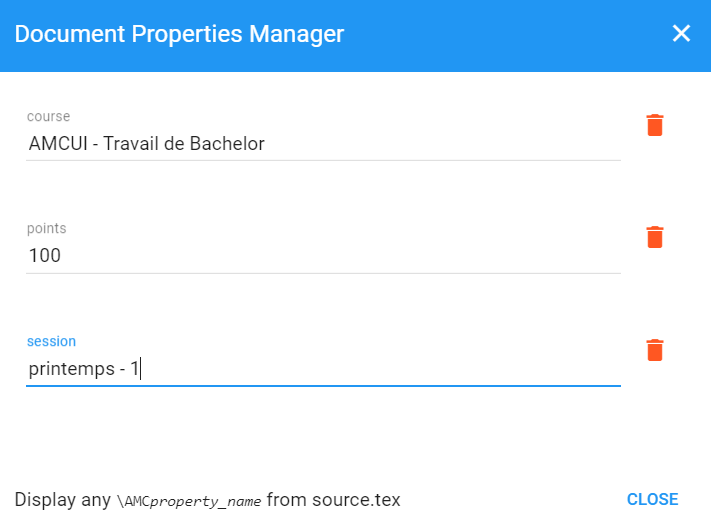
 *Figure 12 - Propriétés du modèle*

Les propriétés du Template vous permettent d'ajouter le titre du cours, le nombre de points totaux de l'examen ainsi que la session durant laquelle l'examen sera passé.

::: tip
Pour recharger à nouveau un modèle, il suffit d'effacer tout le contenu de l'onglet source.tex sous l'options LaTeX.
:::

## Visualiser l'examen

Tous les changements sont visibles lorsque vous cliquez sur le bouton **Preview** (Figure 11). Ce bouton permet d'ouvrir une boîte modale (une fenêtre à l'intérieur de l'application) vous permettant alors de visualiser l'examen. Très utile avant de l'imprimer ! Faites bien attention à toujours attendre que le bouton _Preview_ soit disponible.

::: warning
Il y a des risques que l'applciation se bloque quand on appuis sur le boutton quand il est encore en compilation. Dans ce cas il suffit d'attendre un peu ou de recharger la page si cela ne répond vraiment plus.
:::

La boîte modale (Figure 13) montre un exemple de visualisation pour le Template HEG-QCM que nous venons de charger.

Nous voyons bien que les informations insérées dans les documents properties sont bien présentes dans l'examen lorsque l'on visualise ce dernier.

 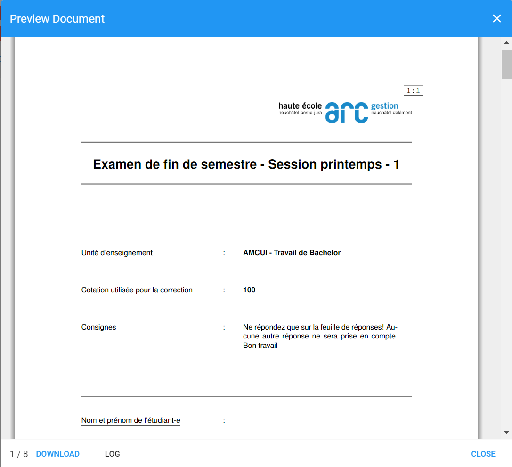
*Figure 13 - Boîte modale de prévisualisation*

## Élaboration de l'examen

Un examen est composé d'au moins une section avec des questions. Les sections permettent un meilleurs contrôle sur la génération des séries et mélanges de questions.

### Ajout d'une section

Pour bien gérer vos sections, il vous faut d'abord comprendre comment fonctionne la barre de menu lié à une section (Figure 14). Une section correspond en général à un chapitre du cours, mais vous pouvez les utiliser comme vous le désirez. Nous allons remplacer le texte **« Add Section »** par le nom du chapitre sur lequel nous allons tester les étudiants, dans le cadre de ce tutoriel nous allons nommer la section « Culture musicale ». Juste en dessous de la barre de menu de la section, vous pouvez entrer un texte explicatif concernant la section (facultatif).

 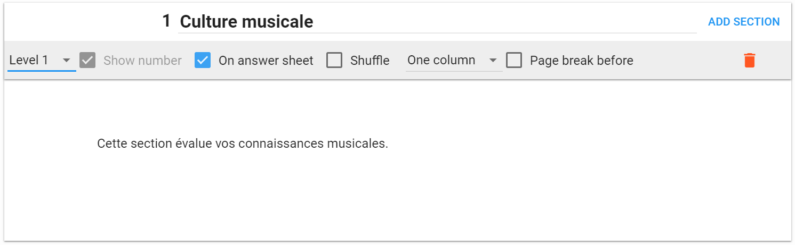
*Figure 14 Boîte de section*

Nous allons maintenant passer en revue chaque fonctionnalité de la barre de menu (Figure 14) de gauche à droite.

Le premier élément à gauche est une liste déroulante vous permettant de choisir le niveau de la section. Elles sont similaires à la numération des chapitres dans Word.

Ainsi le niveau 1 aura un simple numéro, généralement dédié à un chapitre comme dans l'exemple montré à la Figure 14 (1). Le niveau 2 correspond généralement à un sous-chapitre et aura deux numéros (par exemple 1.1). Le niveau 3 suit la même logique et sa numération est constituée de trois numéros (par exemple 1.1.1).

Le deuxième élément **« Show number »** permet d'afficher/cacher le numéro de la section dans l'examen.

Le troisième élément **« On answer sheet »** permet d'afficher le nom de la section dans la feuille de réponse si la case est cochée. La feuille de réponse en mode QCM est l'avant-dernière feuille lorsque vous visualisez l'examen. C'est sur celle-ci que l'étudiant notera ses réponses.

Le quatrième bouton **« shuffle »** permet de mettre les questions dans le désordre au sein d'une section. Très pratique pour imprimer une deuxième série.

Le cinquième élément représente le **nombre de colonnes** sur lequel vous désirez afficher vos questions. Pour l'instant soit vous pouvez utiliser une colonne et ainsi avoir toutes les questions les unes après les autres ou avoir deux colonnes pour avoir une question à droite et une question à gauche à la même hauteur dans l'examen (exemple aux Figure 16 et Figure 17).

 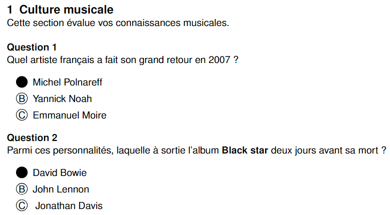
*Figure 16 Exemple d'affichage sur une colonne*

 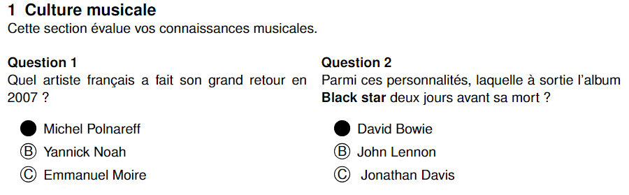
*Figure 17 Exemple d'affichage sur deux colonnes*

Le sixième bouton **« page break »** vous permet de faire un saut de page pour être sûr de commencer la section sur une nouvelle page.

::: danger ATTENTION
La corbeille en rouge vous permet de supprimer la section. Il n'y a pas de confirmation, l'effacement est donc immédiat! Il existe la possibilité d'utiliser la fonction restore depuis l'onglet **« history »** pour revenir en arrière au dernier point de sauveguarde.
:::

 Finalement le bouton **« add section »** vous permet d'ajouter une nouvelle section.

Vous avez la possibilité de naviguer entre vos différentes sections en utilisant le menu disponible à gauche de l'écran (Figure 15).

 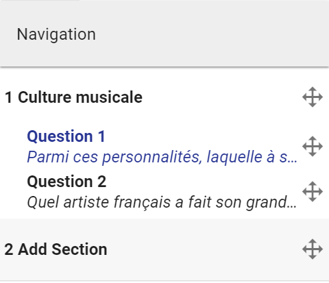

 *Figure 15 menu de navigation entre sections*

Vous pouvez également depuis ce menu de navigation utiliser les flèches directionnelles afin de changer la position d'une section ou même déplacer une question dans une autre section.

### Barre d'édition (questions)

AMCUI vous propose d'éditer et gérer le style de vos réponses avec la barre de menu qui apparaît lorsque vous souhaitez écrire la question (Figure 18 Barre d'édition de question). De gauche à droite nous avons :

 
*Figure 18 Barre d'édition de question*

  pour mettre un élément en gras.

  pour mettre un élément en italic.

  pour mettre un élément en police monospace

 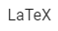 pour mettre un élément sous format LaTeX

  pour mettre un élément dans un format de type :

- **p** – paragraphe
- **h1** – header 1 (grand titre)
- **h2** – header 2 (titre moyen)
- **h3** – header 3 (petit titre)

  liste à puce

  liste numérotée

  placer la sélection au centre

  ajouter une image.

 Le gestionnaire d'image support l'upload par drag and drop. En plus des fichiers images png, jpg, le format **PDF** est également supporté comme format vectoriel.

 ::: tip
 Uploader une image avec le même nom que l'existante, va l'écrasser et la remplacer partout où celle-ci est utilisée.
 :::

  ajouter un bloc de code

Le bloc de code s'ajoute sous la forme d'une boîte, cliquer dessus pour ajouter votre code et choisir le type de langage (pour la syntaxe en couleurs).

 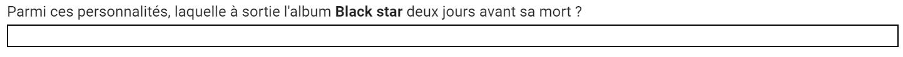
*Figure 19 Bloc de code dans l'éditeur*

En cliquant sur le bloc de code dans l'éditeur (Figure 19), une nouvelle fenêtre modale apparaît comme montrée dans la Figure 20. Le premier élément de cette boîte modale est une liste déroulante vous permettant de choisir le langage utilisé. Dans l'exemple ci-dessous nous avons mis un petit bout de code HTML. Une fois l'élément de liste choisi en HTML le code se met en couleur, pratique pour la lisibilité du code.

 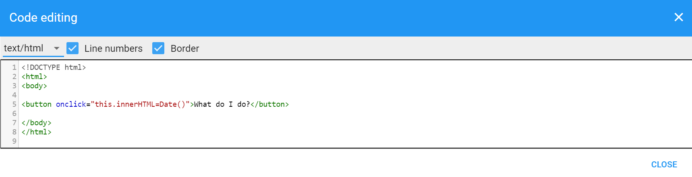
*Figure 20 Bloc de code - Modale*

  permets de mettre un contour autour du texte séléctionné

::: tip
Si vous vous êtes trompé et désirez supprimer le contour, passez en mode HTML avec le bouton **Switch View** et supprimer les balises &lt; **box** &gt; et &lt;/ **box** &gt;.
:::

  permet de changer la vue en passant du texte plein à du code HTML

### Ajout d'une question (généralités)

Maintenant que vous savez comment gérer une question, il est temps d'aller droit au but: la mise en place des questions. Comme dans le chapitre précédent, nous allons d'abord comprendre comment la barre de menu des questions est utilisée et à quoi sert chaque bouton. Tout d'abord cliquer sur le bouton **« Add question »** qui se situe juste en dessous du bloc de section. Une nouvelle boîte apparaît alors. Nous allons maintenant détailler les fonctionnalités mises à dispositions par cette boîte, comme pour la barre de menu de la section, nous allons balayer les fonctionnalités de gauche à droite (Figure 21).

 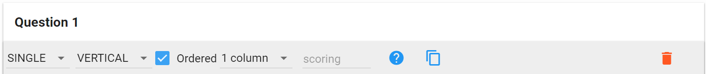
*Figure 21 Barre de menu de la boîte de question*

Le premier élément est une liste déroulante vous permettant de choisir **le type de question** que vous voulez insérer. À l'heure actuelle, il existe trois types de questions

- **Single** Question à choix unique (une seule bonne réponse possible)
- **Multiple** Question à choix multiple (une à plusieurs bonnes réponses possibles)
- **Open** Question ouverte (avec bloc de réponse)

Nous verrons comment mettre en place chacune des questions un peu plus loin dans ce guide.

Le deuxième élément représente la manière dont vous voulez afficher vos réponses (dans le cas d'une question de type single ou multiple). Vous pouvez les afficher de manière verticale (option par défaut) ou de manière horizontale.

Le troisième élément **« Ordered »** est une case à cocher permettant de définir si les réponses doivent toujours s'afficher dans l'ordre dans lequel vous avez créé les réponses. En décochant cette case, les réponses ne seront pas dans le même ordre d'une série à l'autre.

Le quatrième élément est une nouvelle liste déroulante, vous permettant ainsi de choisir si vous voulez afficher vos réponses sur une, deux ou trois colonnes. C'est un peu le même principe que pour l'affichage des questions sur une ou deux colonnes, mais cette fois pour les réponses !

Le cinquième élément, et pas des moindres est l'élément contenant le mot clef **scoring**. Il vous permet de paramétrer des attributs avancée du scoring de la question (voir [paramétrage du barème pour une question](advanced.html#parametrage-du-bareme-pour-une-question)).

## Types de questions

### Question à choix simple

Une question à choix simple ne possède qu'une seule bonne réponse.

Cliquer sur **« Add question »** dans la boîte qui se trouve en dessous de la section. Puis sélectionner dans le premier élément (liste déroulante) le mot clef **single**. Nous allons créer une question qui vaut 1 point. Par défaut, une question vaut 1 point, nous pouvons donc laisser l'élément **scoring** vide. Puisque nous sommes toujours dans la section **Culture musicale** que nous avons créée précédemment nous allons donc ajouter une question d'ordre musical.

En dessous de la barre de menu de question existe un espace libre pour écrire votre question. La question est la suivante :

_« Parmi ces personnalités, laquelle a sorti l'album Black star deux jours avant sa mort ? »_

En dessous de la question se trouvent les blocs de réponses QCM. Nous allons donc écrire la bonne réponse qui est bien sûr **David Bowie**. Puisque c'est la bonne réponse, cliquez tout simplement sur la petite croix blanche et rouge à gauche du bloc de réponse pour que le projet détecte la réponse comme étant correct.

Nous allons ajouter deux autres réponses, John Lennon et Jonathan Davis. Pour ce faire cliquer sur le bouton **Add Answer** et ajouter les nouvelles réponses.

 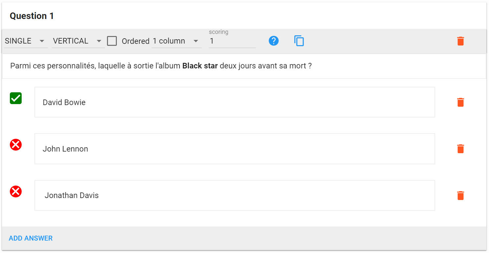
*Figure 22 Question à choix simple*

### Question à choix multiple

Une question à choix multiple possède une ou plusieurs bonnes réponses et possède toujours le symbole du trèfle () à côté du numéro de la question. Cliquer sur **Add question** en bas de la page pour ajouter une nouvelle question et choisissez dans la liste déroulante le mot clef **multiple**.

Dans une question multiple, il y a toujours la réponse «  **None of the above »** qui apparaît dans le cas où aucune réponse n'est correcte. Dans ce tutoriel nous voulons une logique assez simple pour compter le nombre de points par question.

La question est la suivante _« Lequel de ces titres n'est pas une chanson ? »_ Voici un exemple de ce que nous venons de créer à la Figure 23.

 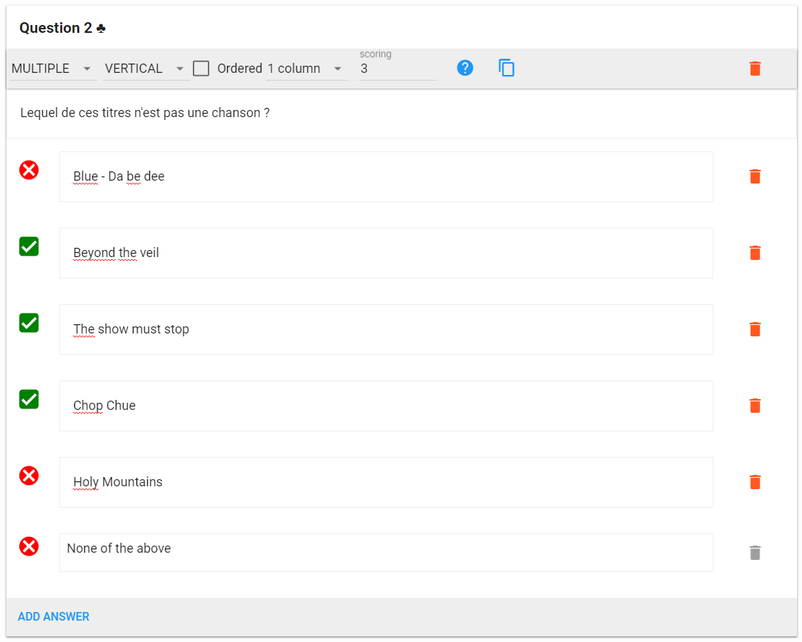
*Figure 23 Question à choix multiple*

Ne vous inquiétez pas, la dernière réponse disponible **None of the above** est automatiquement traduite en français dans l'examen final.

Par défaut la question vaut 1 point et toutes les bonnes réponses doivent être cochées ( **mz=1** par défaut).
Pour une configuration avancée d'une questions avec points négatifs voir ([paramétrage du barème pour une question](advanced.html#parametrage-du-bareme-pour-une-question)).

### Question ouverte

Une question ouverte ne peut pas être corrigée automatiquement, cependant vous pourrez directement attribuer le nombre de points lors de la phase de correction pour faciliter le calcul de la note finale. Une question ouverte comporte toujours un bloc de réponse que vous pouvez manipuler. La barre de menu de question change un peu pour les questions ouvertes, nous allons visiter les fonctionnalités offertes par cette nouvelle barre de menu (Figure 24).

 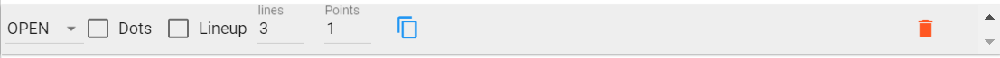
*Figure 24 Barre de menu - question ouverte*

Le premier élément est le même que pour les questions à choix, il s'agit de la liste déroulante permettant de choisir le type de question.

Le deuxième élément est une case à cocher nommée **Dots** ou points en français permettant de cacher ou d'afficher une ligne de points par ligne dans le bloc de réponse.

Le troisième élément **« lineup »** permet de réduire le bloc de réponse dans la feuille de réponse en fin de l'examen s'il est coché. Utiliser le bouton de prévisualisation pour choisir la manière dont vous voulez le mettre en place.

Le quatrième élément **« lines »** vous permet de choisir le nombre de lignes que le bloc de réponse doit avoir.

Le cinquième élément **scoring** dans le cadre des questions ouvertes n'est pas similaire aux autres éléments **scoring** des questions à choix simple et multiple. Ici vous n'avez qu'à indiquer le nombre de points que vous désirez attribuer à la question. Nous définissons une question à 6 points.

 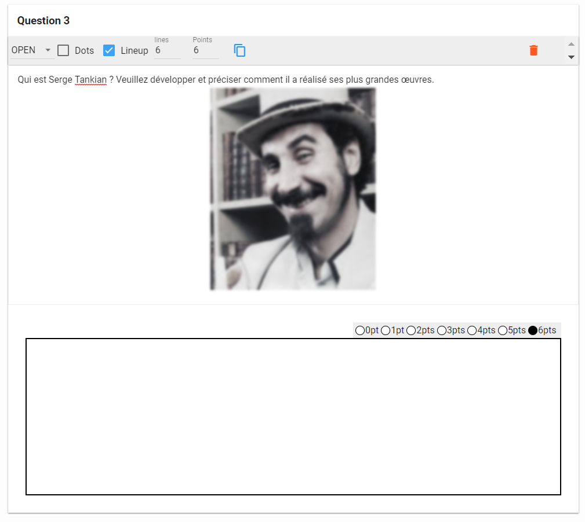
 *Figure 25 Example de question ouverte*

Notre question ouverte sera _« Qui est Serge Tankian ? Veuillez développer et préciser comment il a réalisé ses plus grandes œuvres._ »

Nous allons ajouter une image en utilisant la barre d'édition de texte pour donner un peu plus de détail aux étudiants. Après tout il est plus facile de retenir un visage qu'un nom. L'exemple de la Figure 25 montre le résultat obtenu. Enfin nous plaçons 6 points à la question et mettons à dispositions 6 lignes de réponses. Nous n'allons pas activer les **Dots** afin que l'étudiant puisse gérer le bloc de réponse comme il le souhaite.

Vous pouvez constater le nombre de points qui apparaît au-dessus du bloc de réponse.

Une fois les trois questions créées nous allons faire en sorte que le tout tienne sur une page. La première question aura les réponses affichées horizontalement. La deuxième question aura les réponses affichées verticalement sur deux colonnes et finalement nous rapetissons l'image de la question ouverte et la centrons. La prévisualisation des trois questions se trouve à la Figure 26.

 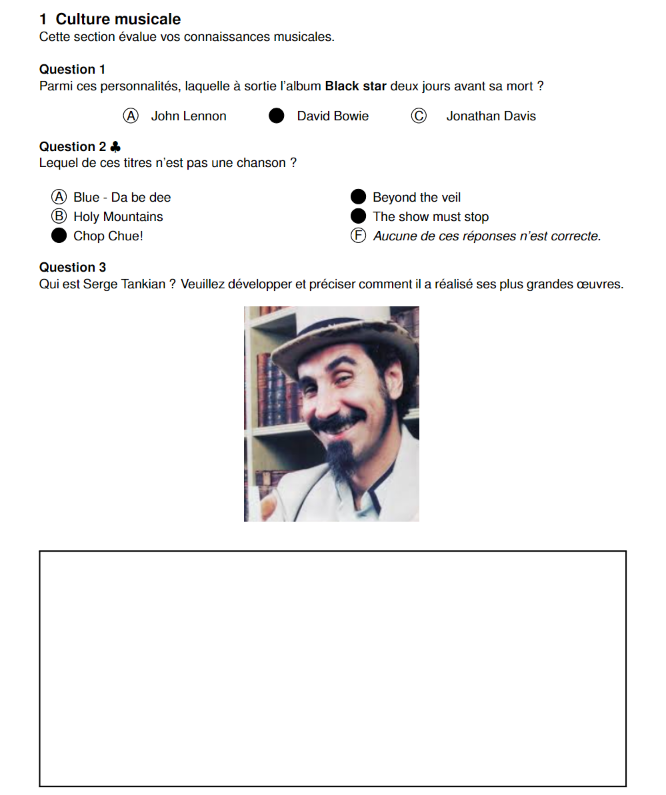
*Figure 26 Prévisualisation de l'examen avec une question de chaque type*

## Copier des questions et sections
En plus de pouvoir dupliquer un projet dans le menu principal, vous pouvez copier des sections et des questions vers un nouveau projet.

::: tip
Vous pouvez tout à fait copier une section ou une question vers le même projet, utile lorsque vous avez travaillé sur le format qu'une question de manière à éviter de refaire le même travail.
:::

Pour ce faire, rendez-vous dans le menu de navigation à gauche dans l'onglet d'édition. À la fin de la dernière section et de la dernière question se trouve un bouton **« Activate copy »**.

Cliquez dessus et sélectionnez les éléments que vous désirez importer puis choisissez le projet de destination. Le projet source étant le projet sur lequel vous êtes actuellement.

Dans ce cas nous voulons copier la question 3 de la section vers le projet « test\_2 ».

 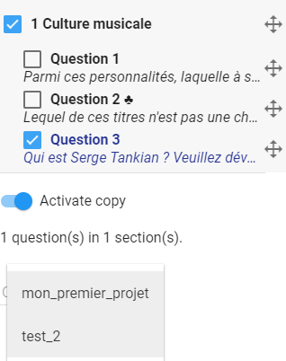

*Figure 34 Copier un élément vers un autre projet*

 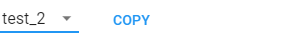

Une fois le projet sélectionné une nouvelle ligne s'affiche comportant le bouton copy. Appuyez dessus pour lancer la copie.

*Figure 35 Bouton copy*

Cela va automatiquement vous changer de projet et vous pourrez constater que la copie s'est bien effectuée vers le nouveau projet.

 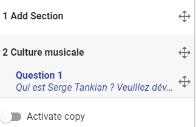

## Impression des séries

Pour l'étape d'impressions, il y a quelques petits paramétrages disponibles dans l'onglet options.

- Le nombre de copies que vous désirez imprimer
- Si la feuille de réponse est générée dans un fichier séparé ou non

::: warning
Attention de ne pas mélanger les séries et feuille de réponses différentes!
:::

Dans ce petit tutoriel, nous allons imprimer 2 copies d'examens afin d'avoir 2 séries que nous photocopierons pour les étudiants (par exemple 10 copies de la série A et 10 copies de la série B). Vous pouvez également si vous le souhaitez avoir une fiche par étudiant (si vous avez une classe de 30 étudiants, vous pouvez demander la génération de 30 copies). Pour faciliter un peu la logistique, nous n'allons pas séparer la feuille de réponse dans un autre fichier PDF. Nous ne cochons donc pas la case **« Print answersheet in separate file. »**.

 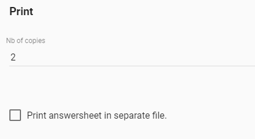

*Figure 37 Options d'impression*

Appuyez sur le bouton **« save options »** et retournez dans l'onglet d'édition. Vérifiez bien que votre examen correspond à vos attentes via le bouton de prévisualisation, si vous n'êtes pas satisfait faites les dernières modifications avant de lancer l'impression.

Dans notre cas nous allons changer le nombre de points dans les documents properties afin de correspondre au nombre de points dans l'examen. La première question vaut 1 point, la deuxième vaut 6 points et la dernière aussi 6 points, nous écrivons donc 13 dans la case correspondante des **documents properties** pour avoir un total de 13 points affiché sur la page de garde.

Une fois que vous êtes prêt, appuyez alors sur le bouton **« print »** qui se situe en haut à droite dans la barre de menu de l'onglet édition. Une barre de progression s'affiche, l'application génère alors vos précieux fichiers PDF dans un dossier ZIP.

Voici ce qui se trouve à l'intérieur du fichier zip.

 

*Figure 38 Dossier généré*

Les sujets sont vos différentes séries (dans notre cas nous avons deux séries grâce au paramétrage du nombre de copies). Et à la racine vous avez le catalogue qui est concrètement la version de base l'examen (ordre des questions pour phase grade) ainsi que les corrigés de chaque série.

Nous allons imprimer une version de chaque série (dossier sujets).

::: tip
Lors du passage de l'examen, n'hésitez pas à rappeler à vos étudiants de bien colorier les cases à cocher.
Les cases qui ont été cochées par erreur doivent être effacé au correcteur à bande ou liquide.
:::

::: danger
Ne surtout pas redessiner les ronds vides après avoir effacé. Laissez la zone blanche.
:::

