# Grade : attribution des notes

Ce chapitre est dédié à l'association des copies avec les étudiants et à la correction de l'examen.

## Ajout des étudiants dans le projet

Maintenant que les feuilles de réponses sont uploadées dans le système, nous pouvons accéder à l'onglet **« grade »**. Récupérez le fichier CSV qui vous est fourni par l'école et assurez-vous bien que les en-têtes possèdent au minimum un en-tête nommé **« name »** celle-ci est obligatoire.

À la Figure 43 un exemple de fichier CSV que nous allons utiliser dans ce tutoriel notez toutefois qu'il n'est pas obligatoire d'ajouter le champ **« id »,** car celui-ci est généré automatiquement. Si vous avez vos propres identifiants pour les étudiants alors, utilisez un en-tête ID.

Il suffit ensuite de copier-coller votre liste CSV dans la barre de l'onglet **« grade »**.  Ouvrez votre fichier CSV avec un autre outil qu'Excel. Vous pouvez utiliser un éditeur de texte comme notepad ++ par exemple. Cela vous permettra d'afficher la liste d'étudiant avec le *séparateur virgule, point-virgule ou encore tab*. Copier-coller le tout dans la partie supérieure de l'application (Figure 43).

 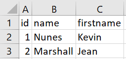 ![students_csv]

 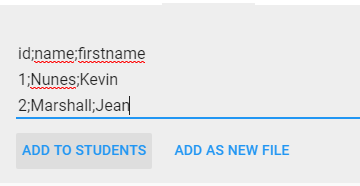

*Figure 44 Ajouter les étudiants dans l'application*

:::tip
Copier coller depuis excel fonctionne bien. Il faut vérifier à avoir au moin une colonne id et name.
:::

:::tip
Si aucune colonne id est fournie le sytème ajoute lui même un numéro unique à chaque étudiant.
:::

:::warning
Pour profiter de l'association automatique des étudiants, il faut que le modèle possède une zone dédié à la saisie des id.
:::

Une fois que vous avez importé votre liste d'étudiant dans le champ dédié, à cet effet cliquez sur le bouton **« add to students »**. Cela va afficher les étudiants insérés dans le tableau de note (Figure 45). Nous allons donc pouvoir commencer l'association entre les copies et les étudiants !

 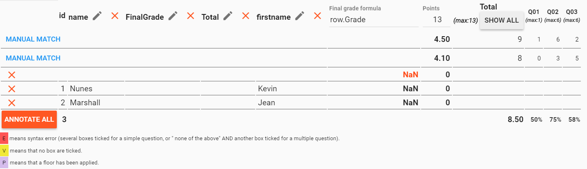

*Figure 45 Tableau des notes*

## Association des copies avec les étudiants

Nous constatons maintenant que les étudiants Nunes et Marshall sont bel et bien présents dans le tableau de note disponible dans l'onglet **grade** (Figure 45). On voit aussi les deux copies que nous avons uploadées depuis l'onglet scan, elles indiquent **« manual match »** qui signifie en français « correspondance manuelle ».

Cliquer sur **« manuel match »** pour commencer l'association des copies avec les étudiants. Une fenêtre va alors apparaître et va vous afficher la case comportant le nom et le prénom de l'étudiant (Figure 46). Au bas de cette fenêtre, vous aurez accès aux noms des étudiants (les informations contenues dans l'en-tête **« name »** ). Le but est de tout simplement associer les copies avec les noms correspondants. Souvenez-vous, dans le chapitre précédent nous avons ajouté des en-têtes **id, name et firstname****. **Seul l'en-tête** name **est obligatoire, vous pouvez également ajouter le prénom dans l'en-tête** name** pour que l'application affiche directement le nom et prénom de l'étudiant. Dans notre cas, nous avons séparé les en-têtes donc nous n'aurons que le nom qui s'affiche dans l'élément en dessous de la fenêtre.

::: tip
Vous pouvez utiliser `↓` pour selectionner  + `enter` pour associer avec le clavier.
:::

 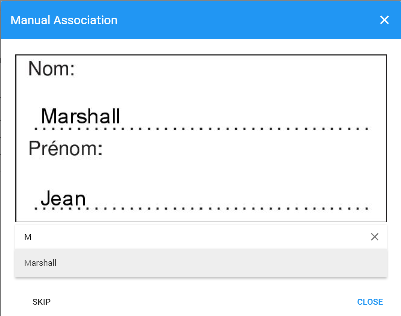
*Figure 46 Association copie/étudiant*

L'application va automatiquement passer en revue toutes les copies n'ayant pas encore d'association. Lorsque vous avez passé en revue toute les copies à associer la boîte modale vous alerte que chaque copie à bien une correspondance.

:::warning
Après avoir tout associé il est recommandé de recharger la page pour être sûr que tout est chargé correctement.
:::

Complétez donc les associations et admirez le résultat dans le tableau de note (Figure 48).

 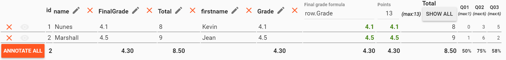
*Figure 48 Tableau de note avec copies associées*

Les copies ont maintenant été associées à chaque étudiant et nous avons à disposition la note obtenue pour chaque étudiant. Vous pouvez si vous le souhaitez adapter le barème dans l'élément **« point »** pour par exemple offrir des points bonus.

Vous avez également la possibilité, dans la partie droite du tableau, de cliquer sur **« show all »** pour avoir accès au détail des questions et ainsi voir le résultat de l'étudiant pour chaque question. En cliquant sur un détail de question pour une ligne (donc un élève), vous serez automatiquement redirigé vers la feuille de réponse de l'étudiant en question.

## Vérification manuelle d'une copie

Redirigez-vous vers la feuille de réponse en cliquant sur le nombre de points obtenus à la question lorsque vous avez des doutes (Figure 48). Des avertissements vous aident en signalant qu'il faudrait peut-être revoir manuellement une copie.

Voici le résumé simplifié des paramètres (ils se trouvent justes en dessous du tableau, Figure 49).

 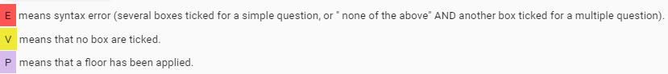

*Figure 49 Alerte du tableau de notes*

Lorsque la cellule est en rouge, cela signifie que l'étudiant

- à cocher plusieurs cases sur une question à choix simple
- à cocher la case « aucune de ces réponses n'est correcte » ET une ou plusieurs autres cases sur une question à choix multiple

Lorsque la cellule est en jaune cela signifie que l'étudiant n'a coché aucune réponse (ou peut-être que le seuil de noir était trop élevé et l'application n'a pas détecté la case)

Lorsque la cellule est en violet clair, cela signifie que la note plancher est atteinte.

N'hésitez pas à faire une vérification manuelle lorsque vous êtes redirigé vers la feuille de réponse scannée. Vous pouvez cliquer sur une case bleue pour la rendre détectable ou cliquer sur une case rouge pour que l'application ne la détecte plus (Figure 50).

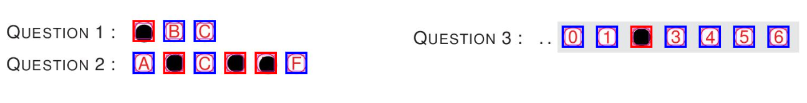
*Figure 50 Vérification des réponses*

Dans la figure ci-dessus les carrés entourant les cases à cocher possèdent des traits pleins. Si vous cliquez sur un des carrés, les traits changeront de couleur et le contour sera discontinu. Une couleur rouge signifie que l'application a bien détecté une case comme étant cochée, une couleur bleue signifie que l'application n'a pas détecté la case comme étant cochée.

## Annotation des copies (options)

Avant de lancer l'annotation automatique des copies, vous pouvez configurer quelques paramètres pour que l'annotation satisfasse au mieux vos besoins. Rendez-vous donc dans l'onglet **« options »** dans la sous-section **« annotation »** (Figure 51).

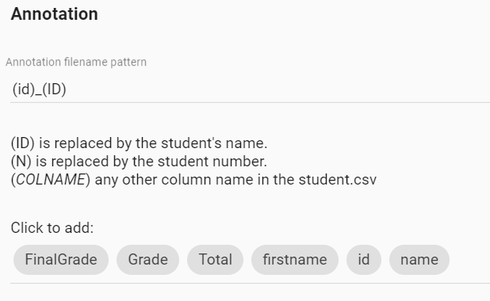

*Figure 51 Paramètre d'annotation - Pattern de nommage*

Par défaut l'ID est remplacé par la colonne **name** du fichier CSV que vous avez importé. La première partie est utilisée pour nommer le fichier annoté qui sera généré.

Vous pouvez ajouter d'autres informations. Cliquer simplement sur les boutons gris qui se situent au bas de la sous-section pour ajouter les informations que vous désirez avoir sur la fiche.

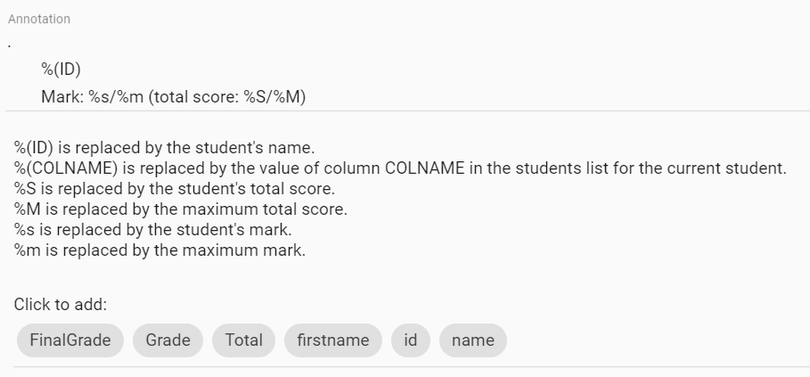

*Figure 52 Paramètre d'annotation - Affichage de la note*

La deuxième partie du paramétrage concerne l'affichage de la note sur les copies annotées. Par défaut, l'application va afficher l'ID de l'étudiant (son nom), la note de l'étudiant ainsi que le nombre de points obtenus sur le nombre total de points. Vous pouvez modifier l'affichage de ses informations en ajoutant de nouvelles informations en cliquant sur les attributs en dessous de la sous-section.

 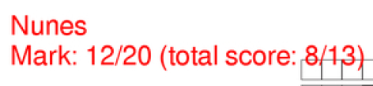

 *Figure 53 - Exemple d'affichage du nom et de la note*

 Dans ce tutoriel nous avons déjà affiché le nom et le prénom de l'étudiant sur la fiche, nous ne rajouterons pas de nouvelles informations sur la copie annotée.

 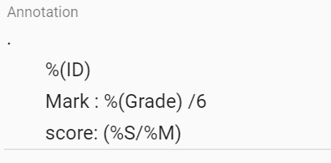

 *Figure 54 Exemple d'annotation*

Nous voulons maintenant afficher le score de la manière suivante : **noteEtudiant**  / 6 ainsi que le nombre de points obtenu sur le nombre de points total. Voici ce qu'il faudrait faire dans les options d'annotation pour la note (Figure 54).

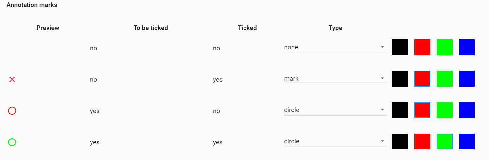

*Figure 55 Paramètre d'annotation - Marquage des réponses*

Finalement, vous pouvez paramétrer le type de marquage que l'application va effectuer lors de l'annotation de la copie. Par défaut la marque des notations est comme dans l'exemple ci-dessous :

 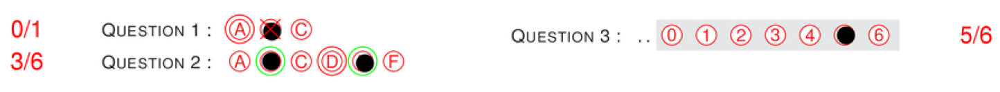

*Figure 56 Exemple d'annotation (par défaut)*

Une croix rouge signifie que l'étudiant a répondu faux, tandis qu'un cercle vert indique qu'il a répondu correctement. Un cercle rouge entoure la bonne réponse qui a été manquée. Ainsi l'on peut constater par exemple à la question que l'étudiant à obtenu 2 réponses justes (2x2 points) et a oublié la réponse D (-1 point) le résultat est donc celui que l'on souhaitait (2x2-1=3).

AMCUI vous offre la possibilité de personnaliser ces marquages en jouant avec les paramètres et les couleurs mises à disposition par les options d'annotations (Figure 55).

## Annotations des copies (générations des fichiers)

Lorsque vos paramètres sont réglés et que les associations sont faites, rendez-vous dans l'onglet **grade** et cliquez sur le bouton **Annotate all**.

Un document .zip sera alors téléchargeable et contiendra les copies annotées des étudiants. Une technique est de n'imprimer que la première page générée (celle qui contient la note) et de l'ajouter à la map de l'examen. Bien joué, vous avez corrigé les examens !

::: tip
Il suffit de cliquer sur le boutton *export* et de copier coller le contenu de la zone texte dans excel pour continuer.
:::

Alternativement, vous pouvez vous rendre dans l'onglet **option** et cliquer sur le bouton **students.csv** et **export.ods** pour télécharger le fichier CSV (étudiant et notes) et ODS (Synthèse des résultats) contenant la note finale et le nombre de points obtenus (préférez ouvrir ces fichiers avec Excel).

## Synthèse des résultats

AMCUI vous offre la possibilité de consulter les résultats par question. Rendez-vous dans l'onglet **grade** et cliquer sur le bouton **stats** (se trouve à droite du bouton **students** ).  Un nouveau sous-onglet apparaît. Il vous permet de voir quelles réponses ont été cochées et à quel pourcentage ainsi que d'autres informations comme le taux de réussite à la question.

 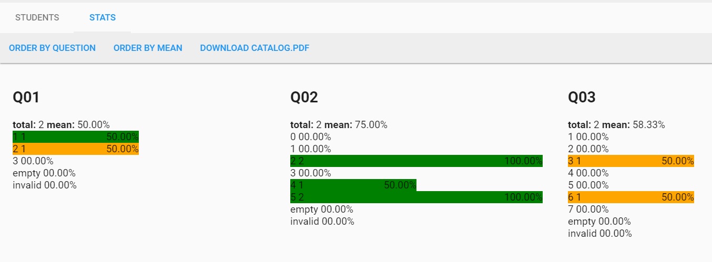
*Figure 57 Statistique de l'examen*

## Ajout de notes de groupes et autres travaux de semestre

Le système support le vlookup entre des feuilles csv importé et les id des étudiants.
Ainsi que le calcule d'une note finale selon une formule.
