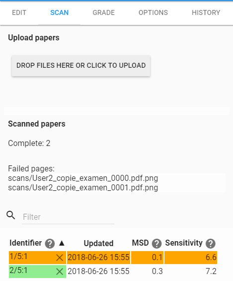
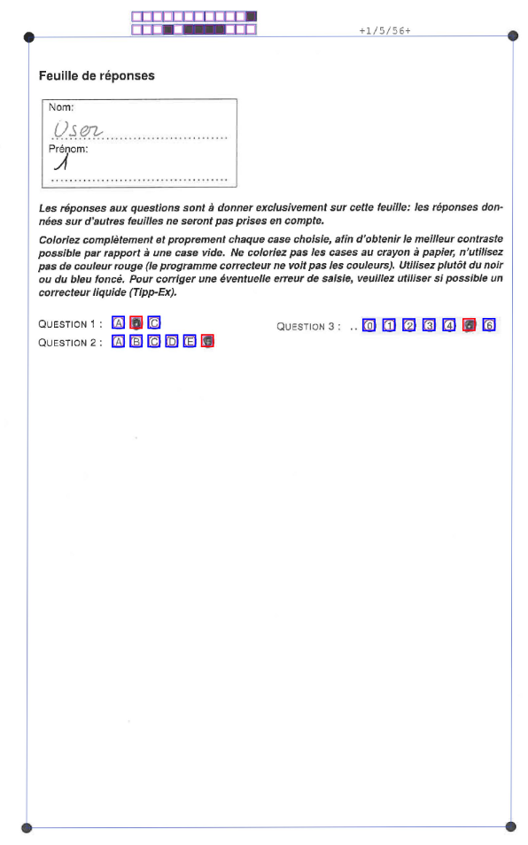
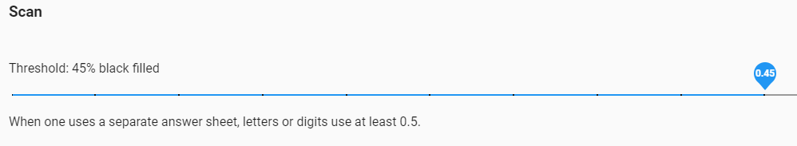

# Scan : lecture des copies

Maintenant que nous savons comment élaborer l'examen, il est temps de le faire passer à vos étudiants. Vous avez besoin de la copie physique des examens rendus par vos étudiants.

Si votre examen contient des questions ouvertes et que vous utilisez le Template HEG-QCM, un petit conseil est de d'abord corriger ces questions et de directement reporter le nombre de points sur la feuille de réponse.

Vous constaterez que les questions ouvertes n'ont pas des lettres dans les cases à cocher, mais bien des numéros. Coloriez donc la case correspondant au nombre de points que vous désirez attribuer.

## Chargement des copies scannées

Une fois que vous avez corrigé les questions ouvertes et reporté le nombre de points sur la grille de réponse vous pouvez passer à l'étape du scannage. Une petite astuce si vos copies sont agrafées est de simplement couper la partie agrafée et de la ragrafer juste après le scan avant de remettre les copies dans la map.

Lorsque vous arrivez sur l'onglet scan pour la première fois dans le projet (disponible uniquement après avoir imprimé les copies) l'application va vous demander quelle méthode d'impression vous avez utilisée, si vous avez généré une copie par étudiant choisissez l'option **« different answer sheets »** tandis que si vous avez généré quelques documents et que vous les avez imprimés plusieurs fois alors choisissez l'option **« some were photocopied »** _._

Dans notre cas, nous avons généré deux séries que nous avons imprimées plusieurs fois. Il faut donc choisir l'option **« some were photocopied »**.

Dans ce tutoriel nous allons analyser une copie de la première série. Vous avez donc récupéré vos fichiers sous format PDF ou tiff et vous allez les uploader dans l'onglet scan. Soit par un drag &amp; drop (déplacer et placer le fichier dans la fenêtre de l'onglet scan) soit en les uploadant depuis votre ordinateur en cliquant tout simplement sur le bouton **« Drop Files here or click to upload »**. De notre côté nous allons utiliser un des scanneurs de l'école et mettre toutes les feuilles de réponses à scanner à la suite, nous ne générons donc qu'un seul fichier PDF qui contient toutes les feuilles de réponse de l'examen.

::: tip
Le format recommandé pour que le processus ne prennent pas trop de temps et de place est: **Tiff 300dpi noir/blanc**.
:::

 

 *Figure 40 Onglet Scan*

Nous allons maintenant tout simplement uploader le document PDF qui contient toutes les feuilles de réponses. Nous avons, au préalable, corrigé les questions ouvertes et avons directement inséré le nombre de points sur la feuille de réponse.

Si des fichiers n'ont pas réussi à passer la phase de scan, c'est qu'il ne s'agissait pas des feuilles de réponses. Seules les feuilles contenant les ronds (les marques de calage) dans chaque coin sont prises en compte par AMCUI.

Une fois que toutes les feuilles ont été scannées, vous avez à disposition des critères de sensibilités indiquant si les cases ont été correctement cochées ou non.

Sur la figure à gauche la copie 1/5 :1 est surligné en orange, car elle est sélectionnée, ce n'est pas un indicateur d'erreur.

Les critères sont les suivants :

- **MSD**: (Écart quadratique moyen) un indicateur du bon calage sur les marques de calage (les quatre ronds noirs dans les coins de chaque copie). S'il est trop important, il faut alors vérifier manuellement la copie.
- **Sensitivity**: (Sensibilité) un indicateur de la proximité de remplissage des cases par rapport à la valeur du seuil de détection de noir. Si elle est trop importante (8 et plus), il faudra alors vérifier manuellement que les cases cochées sont bel et bien celles qui sont détectées par l'application.

En cliquant sur une des copies qui se sont ajoutées à la liste dans le menu de gauche, vous pourrez alors visualiser la feuille de réponse de l'étudiant. Comme présenté à la Figure 41 nous pouvons constater que l'application à bien détecter les ronds dans les coins de la feuille.

En rouge ce sont les cases qui ont été détectées par l'application. La case en haut à gauche contenant le nom et le prénom sera affichée lorsque nous associerons les copies aux étudiants dans le prochain chapitre.

Le bloc de carré de couleur tout en haut de la feuille correspond au numéro de la série.

Si les seuils MSD et Sensitivity sont trop grands, il vaut mieux alors vérifier si la feuille a été correctement scannée et si les cases à cocher sont bien détectées.
Ou il se peut qu'il faillent ajuster le seuil de détection de noir sous options (voir [paramétrage des options de reconnaissance](scan.html#parametrage-des-options-de-reconnaissance))

 

*Figure 41 Feuille de réponse - Série 1 - User 1*

## Paramétrage des options de reconnaissance

Il s'agit du paramétrage du seuil de détection de noir. Dans notre cas, un seuil de détection de 45% du taux de remplissage est suffisant.

Rendez-vous dans l'onglet **« options »** et définissez un seuil de détection à 45% en déplacement le point bleu sur la barre. Cette option permet à l'application de savoir quand il faut reconnaître une case qui a été cochée. Dans notre cas, si la case est noircie à 45% ou plus alors l'application va la détecter.

 

*Figure 39 Option - Seuil de détection de noir*

